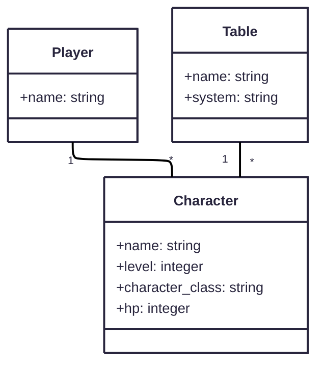

## Characters API - Rails API-only
> O intuito é montar uma API que gerencie de forma básica jogadores, personagens e suas mesas pra N campanhas de RPG.

```mermaid
---
config:
  theme: redux
  layout: elk
---
classDiagram
direction TB
    class Player {
	    +name: string
    }

    class Table {
	    +name: string
	    +system: string
    }

    class Character {
	    +name: string
	    +level: integer
	    +character_class: string
	    +hp: integer
    }

    Player "1" -- "*" Character
    Table "1" -- "*" Character
```